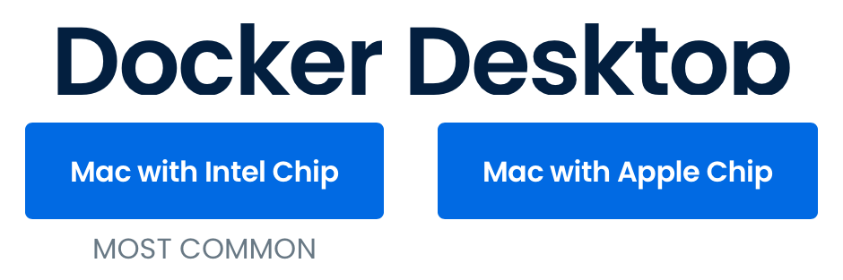
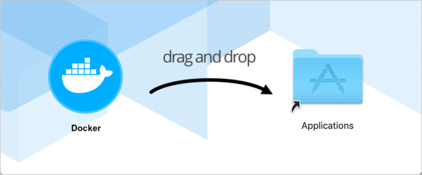
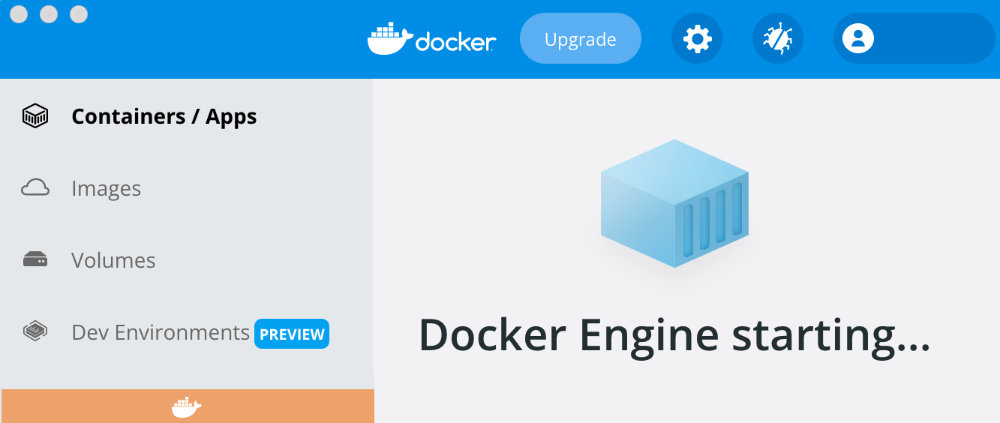
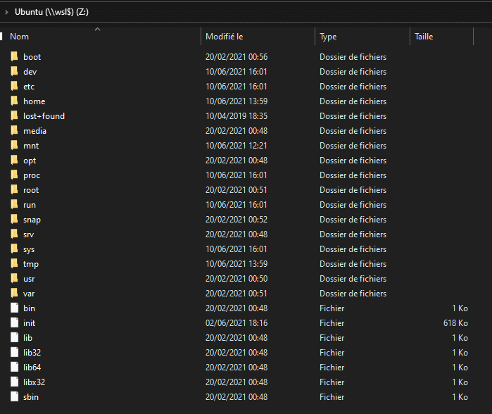

# ACT-Dev - Pré-requis et installation


L'environnement de développement ACT-Dev fonctionne grâce Docker. Une fois installé, le comportement sera quasiment identique sur MacOS, Linux et Windows. L'idée est de maximiser les points communs. Cependant les différences entre ces trois systèmes impliqueront quelques explications différenciées. De nombreuses étapes nécessiteront d'exécuter des commandes bash, dans un terminal. La maîtrise progressive de la ligne de commande constitue de toute façon un point de passage obligé pour tout développeur.


## 1. Pré-requis : Docker et git


### 1.1 Sur MacOS

### 1.1.1 MacOS - Installation de Docker
Sur un Mac à processeur Apple silicon, avant d'installer Docker, il faudra installer Rosetta 2 manuellement à partir de la ligne de commande, car tout le code de Docker n'a pas encore été converti. Dans un terminal, lancer la commande :
```bash
$ softwareupdate --install-rosetta
```

Docker Desktop peut être téléchargé en suivante le lien : https://www.docker.com/products/docker-desktop
**Attention :** au choix de la version selon le processeur, Intel ou Apple Silicon.




Le fichier téléchargé est une image disque `Docker.dmg`. Pour ouvrir l'installeur, double-cliquer sur l'image disque, puis dans la fenêtre qui s'ouvre, glisser-déposer l'icône Docker sur le dossier Applications.



Une fois la copie de l'application Docker vers le dossier Applications terminée, aller dans le dossier Applications, double-cliquer sur l'application `Docker` pour lancer Docker et attendre que Docker Engine se soit lancé.



Il n'est pas nécessaire de suivre le tutoriel : un lien `Skip tutorial` est disponible en bas de l'écran.

Une fois installé l'icône de Docker apparaît dans la barre de menus, en haut à droite :


Si nécessaire, des informations complémentaires pourront être trouvées sur cette page :
https://docs.docker.com/desktop/mac/install/

### 1.1.2 MacOS - Vérification de l'installation de git
Le logiciel de gestion de versions **git** est souvent installé par défaut sur MacOS, mais plus systématiquement dans les dernières versions de MacOS. La commande suivante permet de vérifier la version de git installée, donc sa présence :
```bash
$ git --version
  git version 2.21.1 (Apple Git-122.3)
```
Si git n'est pas installé, le meilleur moyen de l'installer git est de passer par Homebrew, le gestionnaire de paquets pour MacOS. La commande bash pour installer Homebrew est la suivante :
```bash
$ curl -fsSL https://raw.githubusercontent.com/Homebrew/install/HEAD/install.sh
```
Si nécessaire, Homebrew installera automatiquement les Command Line Tools Xcode indispensables à son fonctionnement.
**Remarque :** pour plus d'informations sur Homebrew, https://brew.sh/index_fr

Une fois Homebrew installé, la commande suivante installera git :
```bash
$ brew install git
```
Une fois installé, à nouveau, la commande `git --version` permettra de vérifier le succès de l'installation :
```bash
$ git --version
  git version 2.33.1
```
Pour finaliser l'installation de git, il reste à personnaliser le nom d'utilisateur et l'adresse électronique qui seront utilisés pour le suivi de versions par git :
```bash
$ git config --global user.name "Toto TOTO"
$ git config --global user.email "toto@toto.alsace"
```
Les pré-requis sont ainsi mis en place. L'installation d'ACT-Dev peut maintenant commencer.


### 1.2 Sur Ubuntu

Pour l'installation sur Ubuntu, voir ici :
https://docs.docker.com/engine/install/ubuntu/


### 1.3 Sur Windows
Plusieurs options sont possibles pour l'installation de Docker Desktop sur Windows. Celle choisie pour ACT-Dev est l'installation de Docker Desktop sur WSL 2.

### 1.3.1 Windows - Pré-requis
L'installation nécessite au minimum Windows 10 en version 2004 ou plus récente (build 19041 ou plus récente) ou Windows 11.
Pour vérifier la version de Windows et le numéro de build, taper **touche Windows + R**, puis taper **winver**, puis **OK**.
La commande suivante va installer WSL, à exécuter dans PowerShell, avec Ubuntu 20.04 commet distribution Linux par défaut :
```powershell
wsl --install
```
Une fois WSL installé, lancer Ubuntu à partir du menu `Démarrer`. Il faudra créer un utilisateur pour Ubuntu.

**Attention :**
- n'utiliser que des lettres ou des chiffres pour le nom de l'utilisateur, surtout pas d'espace,
- bien mémoriser cet identifiant et mot de passe : c'est le compte d'administration d'Ubuntu dans WSL.

Ensuite télécharger et installer le package de mise à jour du noyau Linux :
https://wslstorestorage.blob.core.windows.net/wslblob/wsl_update_x64.msi

Dans PowerShell, la commande suivante affiche la liste des distributions installées dans WSL avec leur version :
```powershell
wsl -l -v
```
La version dont il est question est la version de WSL faisant fonctionner la ou les différentes distributions de la liste. Au cas où la version pour la distribution Ubuntu n'est pas la 2, avec les commandes dans PowerShell, il faut :
- indiquer qu'Ubuntu est la version par défaut,
- la mettre à jour vers la version 2,
- indiquer la version 2 comme version par défaut pour les prochaines installations :
```powershell
wsl --set-default ubuntu
wsl --set-version ubuntu 2
wsl --set-default-version 2
```
**Attention :** ne pas installer Docker Desktop avant d'avoir respecté tous les pré-requis.

**Remarque :** plus d'informations pourront être trouvées en suivant les liens suivants :
https://docs.docker.com/desktop/windows/install/
https://docs.microsoft.com/en-us/windows/wsl/install
https://docs.microsoft.com/en-us/windows/wsl/setup/environment#set-up-your-linux-user-info
https://docs.microsoft.com/fr-fr/windows/wsl/install-manual#step-4---download-the-linux-kernel-update-package
https://docs.microsoft.com/fr-fr/windows/wsl/troubleshooting#installation-issues

### 1.3.2 Windows - Installation de Docker
Télécharger la version Docker Desktop pour Windows :
https://desktop.docker.com/win/main/amd64/Docker%20Desktop%20Installer.exe
Puis suivre les instructions d'installation, en activant bien WSL 2 durant l'installation.

Lancer Docker Desktop à partir du menu `Démarrer`, aller dans les préférences de Docker en choisissant `Settings > General` dans le menu Docker et cocher la case `Use the WSL 2 based engine`, avant de cliquer sur le bouton `Apply & Restart`.


Une fois que Docker a redémarré, retourner dans les préférences de Docker en choisissant `Settings > Resources > WSL Integration` et cocher la case `Enable integration with my default WSL disto`, puis cliquer à nouveau sur le bouton `Apply & Restart`.


**Remarque :** plus d'informations pourront être trouvées en suivant le lien suivant :
https://docs.docker.com/desktop/windows/wsl/

### 1.3.3 Windows - Vérification de l'installation de git
Pour toute la suite, les lignes de commandes `bash` sont à exécuter dans WSL 2. Pour rentrer dans WSL 2, il suffit d'exécuter la commande `wsl` dans PowerShell.

La commande `bash` suivante permet de vérifier la version de git installée, donc sa présence :
```bash
$ git --version
  git version 2.33.1
```
Si git n'est pas installé, l'installer avec `apt` :
```bash
sudo apt update
sudo apt install git
```
Pour finaliser l'installation de git, il reste à personnaliser le nom d'utilisateur et l'adresse électronique qui seront utilisés pour le suivi de versions par git :
```bash
$ git config --global user.name "Toto TOTO"
$ git config --global user.email "toto@toto.alsace"
```

**Remarques :**
- il existe une intégration dans VSCode permettant d'éditer plus facilement les fichiers dans WSL 2,
- l'application Windows Terminal permet d'ouvrir plusieurs terminaux dans la même fenêtre,
- l'accès aux fichiers contenus dans l'arborescence Ubuntu se fait grâce à un partage un peu spécial nommé `wsl$` suivi du nom de la distribution, ainsi les liens suivants, côté Windows donnent accès respectivement dans Ubuntu, à la racine, au répertoire des configurations /etc et au répertoire de l'utilisateur TOTO, nom à remplacer par l'utilisateur créé lors de l'installation de la distribution Ubuntu dans WSL 2 :
```powershell
\\wsl$\Ubuntu
\\wsl$\Ubuntu\etc
\\wsl$\Ubuntu\home\toto
```
Le fait d'accéder au point de montage `\\wsl$\Ubuntu` va démarrer automatiquement la distribution Ubuntu cible, si elle n'était pas déjà démarrée. Ce chemin réseau peut être mappé au travers d'un lecteur réseau :



Les pré-requis sont ainsi mis en place. L'installation d'ACT-Dev peut maintenant commencer.


# 2 Mise en place d'ACT-Dev

L'environnement de développement ACT-Dev est hébergé sur GitHub. La récupération du projet va créer un répertoire `ACT-Dev`. Toutes les commandes `bash` qui vont suivre sont à exécuter :
- dans un terminal sur MacOS et Linux,
- dans un terminal ouvert sur la distribution Ubuntu, dans WSL 2, sur Windows. Pour mémoire la distribution Ubuntu est accessible suite à l'exécution de la commande `wsl` dans PowerShell. Ainsi, sur Windows aucune autre commande que `wsl` n'est à exécuter en CMD ou PowerShell : toutes les suivantes seront dans la distribution Ubuntu sur WSL 2.

L'environnement ACT-Dev va être installé par défaut dans le répertoire de l'utilisateur courant Toto nommé ainsi par facilité pour cette documentation. La commande `cd` sans paramètre permet de s'y rendre. La commande `pwd` permet d'afficher le chemin d'accès. Ainsi pour l'utilisateur Toto, qui servira pour la suite d'utilisateur
```bash
$ cd
$ pwd
  /home/toto
```
La récupération de ce projet se fait à nouveau en ligne de commande avec `git clone` suivi ici de la commande `ls -al` pour afficher le contenu du répertoire `/home/toto` :
```bash
$ git clone https://github.com/AssoCoTech/ACT-Dev.git
$ ls -a
  .                     .ssh                    ACT-Dev
  ..                    .gitconfig
```
**Remarque :** dans le cas où git est déjà installé et configuré, avec identification par clef SSH, il est aussi possible de cloner le projet en ssh.

**Attention :** une fois le projet cloné à partir de GitHub, le répertoire ACT-Dev ayant été créé, ce répertoire peut être éventuellement renommé ou même déplacé. Cependant pour garantir le fonctionnement, seules deux possibilité peuvent être envisagées :
- laisser le répertoire dans celui de l'utilisateur courant, donc /home/toto/ACT-Dev,
- déplacer le répertoire dans /opt et le renommer en local, ce qui donnerait le chemin /opt/local.
La dernière solution est assez standard, mais nécessite d'adapter les droits pour permettre à l'utilisateur courant de conserver le droit d
